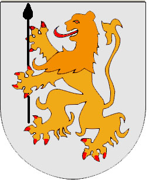

<!DOCTYPE html>
<html lang="pt-br">
<head>
    <meta charset="UTF-8">
    <meta http-equiv="X-UA-Compatible" content="IE=edge">
    <meta name="viewport" content="width=device-width, initial-scale=1.0">
    <link rel="stylesheet" href="portfoliocss.css">
    <title>PORTIFOLIO PESSOAL</title>
</head>
<body>
    

        <header>
            
            <nav><!--indica que é uma navagação-->
                <ul><!--indica o inicio da lista-->
                    <li><a href="#Sobre mim">Sobre mim </a></li> <!--o <li> indica itens da lista e dentro do item tem o link (que no caso é o <a>)-->
                    <li><a href="#Formação">Formação</a></li>
                    <li><a href="#Portfólio">Portfólio</a></li>
                    <li><a href="#Contato">Contato</a></li>
                </ul>
            </nav>
        </header>
        <main>
            

            <article class ="centraliza-container"
             id="Sobre mim">
             <h2>Sobre mim</h2>
             
Olá! Seja bem vindo ao meu portfólio pessoal!

             
Meu nome é Lucas Ronchi de Oliveira. Nasci no dia 4 de Fevereiro do ano de 1998.
                Atualmente tenho 24 anos de idade, trabalho em um escritório de contabilidade, localizado na cidade de Irapuã, SP e curso Análise e Desenvolvimento de Sistemas pela Uninter.
                 Estou namorando a pouco mais de 3 anos e recentemente, no mês de Novembro de 2021 durante uma viagem maravilhosa para Porto Seguro com minha namorada, passamos a ser noivos.
                 Tenho alguns hobbies. Entre eles, meus preferidos são jogos onlines, séries e filmes. 
                 Sobre a escolha do meu curso superior, sempre gostei muito de informática, o que influenciou bastante na minha escolha. 
             

            </article>
            

            <article class="container-article"
             id="Formação">
             <h2 class="texto-direita">Formação</h2> <!--o texto-direita é para diferenciar os tópicos e deixar esse do lado direito-->
             
 Ensino médio completo, formado pela escola "E.E Profª Desolina Betti Gregorin" na cidade de Irapuã, SP.
                 Curso superior em andamento de grau tecnólogo na área de Análise e Desenvolvimento de Sistemas, pelo Centro Universitário Internacional (UNINTER).
             

            </article>
            

            <article class="container-article"
            id="Portfólio">
            <h2>Portfólio</h2>
            
Esse é o primeiro site que desenvolvi!

            </article>
            

            <article class="container-article"
            id="Contato">
            <h2 class="texto-direita">Contato</h2>
            
 Email: luc_srol@hotmail.com
            

           </article>
           

           <a href="#"> &#9650; Voltar ao topo </a>
    

</body>
</html>

    @import url('https://fonts.googleapis.com/css2?family=Racing+Sans+One&family=Raleway:wght@300&display=swap');
*{
    margin: 0;
    padding: 0;
    box-sizing: border-box;
}
body{

    font-family: 'Raleway', sans-serif;
    background-color: #000000;
}
.centraliza-container{
    margin:auto; 
}
div{
    width: 85%;
    background-color: rgb(255, 255, 255);
    padding: 3em;
    box-shadow: 0 0 2.2em rgba(0,0,0, .2);
}

header{
    text-align: center;
}
header ul{
    margin-top: 1.5em;
}
header li{
    list-style-type: none;
    display: inline-block;
    font-family:'Franklin Gothic Medium', 'Arial Narrow', Arial, sans-serif;
    font-size: 2rem;
    margin-right: 2em;
}
header li:last-child{margin-right: 0;}
header a{
    text-decoration: none; color: #c70f0f; padding: .8em;
}
main{
    margin-top: 4em;
}
article{
    width: 95%;
}
p{
    font-size: 1.5rem;
    line-height: 160%;
    margin-bottom: 1em;
}
h2{
    font-size: 4.5rem;
    margin-bottom: .72em;
    font-family:'Franklin Gothic Medium', 'Arial Narrow', Arial, sans-serif ;
    color:#c70f0f;
}
hr{
    width: 85%;
    margin: 4em auto;
    border: 1.5px solid rgba(216,91,83,.25);
    box-shadow: 0px 1px 6px rgba (0, 0, 0, .16);
}
.texto-direita{
    text-align: right;
}
